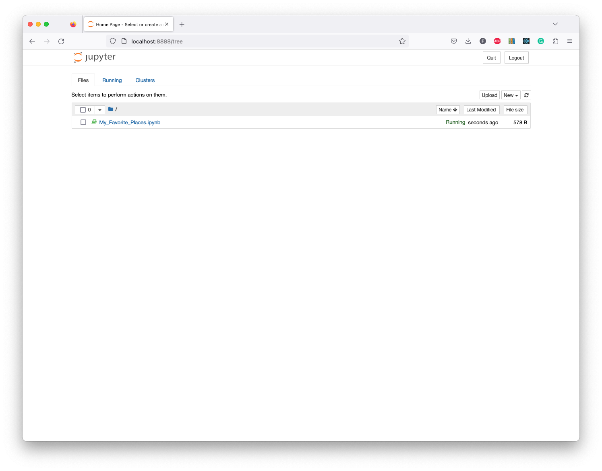

# Notebook

## Create a notebook

We'll create an `/examples` directory to contain our notebooks.

```shell
mkdir examples
```

We can create a new notebook by running the following command:

```shell
poetry run jupyter notebook examples
```

Although we could create notebooks anywhere, it's a good idea to keep them in a dedicated directory.
If we always keep our notebooks in a root directory named `/examples`, we'll always know where to find them when we revisit an old project.

Create a new `Python 3 (ipykernel)` notebook:



Change the name of the notebook to `My_Favourite_Places`.
Then add a title to the notebook by changing the first cell type to `Markdown` and adding the following text:

```markdown
# My Favorite Places
```

Beneath it, add `import my_notes` package to check that everything is working:

```python
import my_notes
```


## Return

[Return to the top-level README](./../../README.md)
